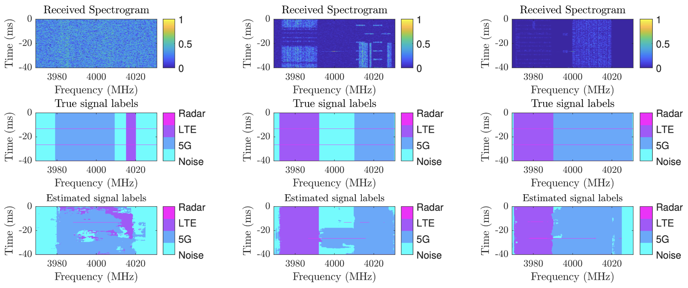

# Spectrum Sensing in Radar-Communications Systems for Signal Identification: Deep Learning with Error-Guided Refinement 

The motivation for this research arises from the limitations of existing spectrum sensing (SS) approaches. Conventional methods are typically constrained to binary classification, merely indicating the presence of a signal without identifying its type or precise spectral location. Although deep learning models based on semantic segmentation provide finer granularity, they encounter a critical trade-off: encoder downsampling often discards important spectral details, while full-resolution models such as PRMNet preserve these details at the cost of prohibitive computational complexity, limiting their real-time applicability. Moreover, most existing models focus primarily on 5G and LTE, overlooking the unique challenge of radar signals, whose short temporal duration makes them especially difficult to segment. These issues underscore the need for an efficient, detail-preserving model capable of pixel-level signal identification with low computational overhead, particularly for challenging radar detection.

This paper makes four key contributions toward improving both the accuracy and efficiency of spectrogram-based signal segmentation. First, we introduce the Optimal Spectrogram Network (OS-Net), a novel encoder–decoder architecture tailored for wireless signal segmentation. Second, we propose Max-pooling with Adaptive Reconstruction (MAR), enabling the decoder to selectively restore salient features from the encoder, thus preserving critical spectral details without added computational cost. Third, we develop Error-Guided Refinement (EGR), an auxiliary loss that directs the model to focus on misclassified pixels, significantly improving accuracy on challenging signals such as radar pulses. Finally, we apply Model Quantization (MQ) to optimize OS-Net for real-time deployment, yielding a compact 4.6M-parameter model that outperforms established baselines like U-Net and PRMNet in both accuracy and speed.

The Python code and dataset provided here are part of the accepted paper in the 2025 International Conference on Advanced Technologies for Communications (ATC) Program, Hanoi Capital, Vietnam, Oct. 2025.

Huu-Tai Nguyen, Hai-Trang Phuoc Dang, Minh-Thanh Le, Van-Ca Phan, and Thien Huynh-The, "Spectrum Sensing in Radar-Communications Systems for Signal Identification: Deep Learning with Error-Guided Refinement," in ATC, Oct. 2025 (accepted).

The dataset can be downloaded from [Kaggle](https://www.kaggle.com/datasets/huutai23012003/radar-5g-lte-spectrogram-c03/data). Please report if it is not available.

If there are any errors or topics that need to be discussed, please contact [Huu-Tai Nguyen](https://github.com/HuuTaiNg) via email at n.huutai231@gmail.com.

